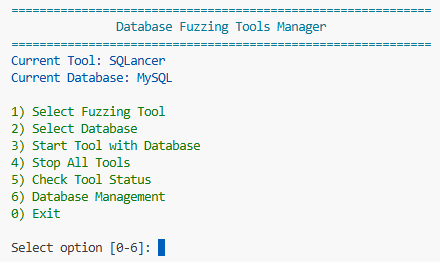
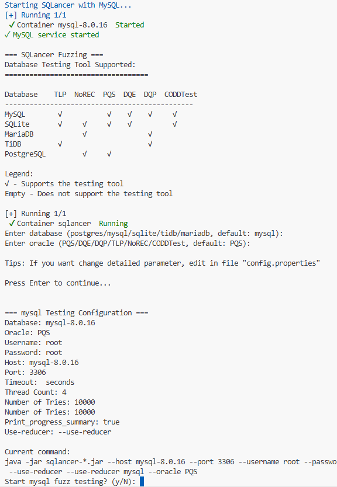
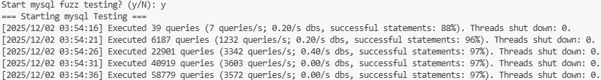

# OpenDBFuzz
An open-source toolkit for DBMS fuzzing.

## Quick Start
```python
python run.py
```
Press `1` and `2` to Choose Tool and Database, press `3` to start tool.

## Directory Structure
In the root directory, there are two folders:
- `DBMS/`: contains the `Dockerfile`, `docker-compose.yml`, and the install ways of DBMSs
- `Fuzzers/`: contains the `run-*.sh`, `Dockerfile`, `docker-compose.yml`, `config.properties` and install ways, to run single tool, go into the directory and `bash run-*.sh`.

## Install
```bash
bash install.sh
```
If you just want test one tool, just run command: `python run.py`, the install will automately start, or go into the dirctory and run command: `docker compose up -d`


## Examle (SQLancer):
```python
python run.py
```
Press `1` to choose Tool, press `3` to choose `SQLancer`. Database default is `MySQL`.



Press `3` to start Tool, enter the database (default mysql) and oracle (default PQS), scripts will output the Current Command.



Enter `y` to start Fuzzing.



## Tips
AMOEBA only support commands to run, since failing easily.

APOLLO only support `Dockerfile`, since defective documents.